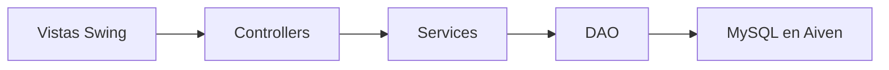

<div align="center">

# Sistema Gestor de Almacén y Usuarios

Aplicación de escritorio para administrar usuarios, productos e inventario mediante Java Swing y una base de datos MySQL alojada en Aiven Cloud.

[](https://www.java.com/)
[](https://www.mysql.com/)


</div>

---

## Descripción

El **Sistema Gestor de Almacén y Usuarios** es una aplicación de escritorio desarrollada en Java para centralizar la administración de usuarios, productos y existencias de un almacén.

El sistema cuenta con autenticación de usuarios, validaciones, operaciones CRUD y persistencia en una base de datos MySQL remota alojada en **Aiven Cloud**. Su interfaz fue construida con Java Swing y el código está organizado en capas para separar la presentación, lógica de negocio y acceso a datos.

## Funcionalidades

### Autenticación

* Inicio de sesión mediante usuario y contraseña.
* Registro de nuevos usuarios.
* Validación de campos obligatorios.
* Verificación de nombres de usuario duplicados.
* Verificación de correos electrónicos duplicados.
* Almacenamiento de contraseñas mediante hash SHA-256.
* Mensajes visuales de validación y error.

### Gestión de usuarios

* Registrar usuarios.
* Consultar los usuarios almacenados.
* Actualizar información personal.
* Eliminar usuarios.
* Mostrar los registros en una tabla.
* Actualizar automáticamente la tabla después de cada operación.

Cada usuario contiene:

* Nombre de usuario.
* Nombre.
* Apellido.
* Teléfono.
* Correo electrónico.
* Contraseña procesada mediante hash.

### Gestión de productos

* Registrar productos.
* Consultar el inventario.
* Actualizar productos existentes.
* Eliminar productos.
* Controlar la cantidad disponible.
* Validar precios y cantidades.
* Mostrar los productos en una tabla.

Cada producto contiene:

* Nombre.
* Marca.
* Categoría.
* Precio.
* Cantidad disponible.

## Arquitectura

El proyecto utiliza una arquitectura por capas inspirada en MVC:



Esta separación permite mantener la interfaz, las validaciones, las reglas de negocio y el acceso a datos en componentes independientes.

## Estructura del proyecto

```text
Sistema-Gestor-de-Almacen-y-Usuarios/
├── Controllers/    # Comunicación entre las vistas y los servicios
├── DAO/            # Acceso y operaciones sobre la base de datos
├── DB/             # Configuración de la conexión MySQL
├── Modelos/        # Entidades Usuario y Producto
├── Services/       # Validaciones y lógica de negocio
├── Utils/          # Utilidades como el procesamiento de contraseñas
├── Vistas/         # Interfaces gráficas desarrolladas con Swing
├── images/         # Recursos visuales y capturas
├── lib/            # MySQL Connector/J
└── README.md       # Documentación principal
```

## Patrones y principios aplicados

El proyecto implementa distintos principios de programación orientada a objetos y patrones de diseño:

| Patrón o principio  | Aplicación                                        |
| ------------------- | ------------------------------------------------- |
| MVC                 | Separación entre vistas, controladores y modelos  |
| DAO                 | Encapsulación del acceso a MySQL                  |
| Singleton           | Instancia única de la conexión a la base de datos |
| Factory             | Creación centralizada de los objetos DAO          |
| Builder             | Construcción de objetos `Usuario` y `Producto`    |
| Encapsulamiento     | Atributos privados y acceso controlado            |
| Abstracción         | Interfaces para servicios y repositorios          |
| Polimorfismo        | Dependencias basadas en interfaces                |
| Prepared Statements | Consultas parametrizadas mediante JDBC            |

## Tecnologías utilizadas

| Tecnología        | Uso                                    |
| ----------------- | -------------------------------------- |
| Java              | Lenguaje principal                     |
| Java Swing        | Interfaz gráfica                       |
| JDBC              | Comunicación con la base de datos      |
| MySQL             | Almacenamiento de usuarios y productos |
| Aiven Cloud       | Alojamiento remoto de MySQL            |
| MySQL Connector/J | Driver JDBC                            |
| Eclipse IDE       | Desarrollo y ejecución                 |
| Git y GitHub      | Control de versiones                   |

## Requisitos

Para ejecutar el proyecto necesitas:

* Java Development Kit instalado.
* Eclipse IDE o cualquier IDE compatible con Java.
* MySQL Connector/J.
* Una base de datos MySQL local o remota.
* Acceso a internet si utilizas Aiven Cloud.

## Instalación

### 1. Clonar el repositorio

```bash
git clone https://github.com/StanleyCM/Sistema-Gestor-de-Almacen-y-Usuarios.git
cd Sistema-Gestor-de-Almacen-y-Usuarios
```

### 2. Importar el proyecto en Eclipse

1. Abre Eclipse.
2. Selecciona `File`.
3. Selecciona `Import`.
4. Entra en `General > Existing Projects into Workspace`.
5. Selecciona la carpeta del repositorio.
6. Finaliza la importación.

### 3. Configurar MySQL Connector/J

El repositorio incluye el driver dentro de:

```text
lib/mysql-connector-j-8.4.0.jar
```

Si Eclipse muestra un error con el driver:

1. Haz clic derecho sobre el proyecto.
2. Entra en `Build Path > Configure Build Path`.
3. Elimina cualquier referencia local que no exista en tu computadora.
4. Selecciona `Add JARs`.
5. Agrega `lib/mysql-connector-j-8.4.0.jar`.
6. Aplica los cambios.

## Configuración de la base de datos

Abre el archivo:

```text
DB/ConexionDB.java
```

Configura la URL, el usuario y la contraseña de tu instancia MySQL:

```java
private static final String URL =
        "jdbc:mysql://HOST:PUERTO/NOMBRE_BASE_DATOS?useSSL=true&serverTimezone=UTC";

private static final String USUARIO = "USUARIO";
private static final String PASSWORD = "CONTRASENA";
```

No publiques credenciales reales dentro del repositorio. Para proyectos en producción se recomienda utilizar variables de entorno o un administrador de secretos.

## Estructura mínima de MySQL

El código utiliza las tablas `usuarios` y `productos`. Puedes crear una estructura compatible con el siguiente script:

```sql
CREATE DATABASE IF NOT EXISTS almacenitlafinal;
USE almacenitlafinal;

CREATE TABLE usuarios (
    idUser INT AUTO_INCREMENT PRIMARY KEY,
    UserName VARCHAR(50) NOT NULL UNIQUE,
    Nombre VARCHAR(100) NOT NULL,
    Apellido VARCHAR(100) NOT NULL,
    Telefono VARCHAR(30) NOT NULL,
    Email VARCHAR(150) NOT NULL UNIQUE,
    Password VARCHAR(64) NOT NULL
);

CREATE TABLE productos (
    idProducto INT AUTO_INCREMENT PRIMARY KEY,
    NombreProducto VARCHAR(120) NOT NULL,
    marcaProducto VARCHAR(100) NOT NULL,
    categoriaProducto VARCHAR(100) NOT NULL,
    precioProducto DECIMAL(10, 2) NOT NULL,
    stockProducto INT NOT NULL DEFAULT 0
);
```

## Ejecución

Después de configurar la base de datos y el driver JDBC:

1. Abre `Vistas/Login.java`.
2. Haz clic derecho sobre el archivo.
3. Selecciona `Run As > Java Application`.
4. Registra un usuario o inicia sesión.
5. Accede a los módulos de usuarios y productos desde la pantalla principal.

## Validaciones implementadas

El sistema comprueba:

* Campos obligatorios.
* Usuarios duplicados.
* Correos duplicados.
* Identificadores válidos.
* Precios no negativos.
* Cantidades no negativas.
* Datos numéricos en precio y existencias.
* Selección de registros antes de actualizar o eliminar.
* Confirmación antes de eliminar información.

Las consultas utilizan `PreparedStatement` para enviar parámetros a MySQL de forma controlada.

## Estado del proyecto

El proyecto cuenta con los siguientes componentes funcionales:

* Autenticación de usuarios.
* Registro de cuentas.
* CRUD de usuarios.
* CRUD de productos.
* Control de existencias.
* Conexión remota a MySQL.
* Interfaz gráfica de escritorio.
* Separación por capas.
* Aplicación de patrones de diseño.

Este repositorio forma parte de mi portafolio académico como estudiante de Desarrollo de Software.

## Autor

**Stanley Camacho Abreu**

Estudiante de Desarrollo de Software y Administración de Bases de Datos.

* [GitHub](https://github.com/StanleyCM)
* [LinkedIn](https://www.linkedin.com/in/stanley-camacho-807121314/)

---

<div align="center">

Desarrollado con Java, Swing, JDBC y MySQL.

</div>
